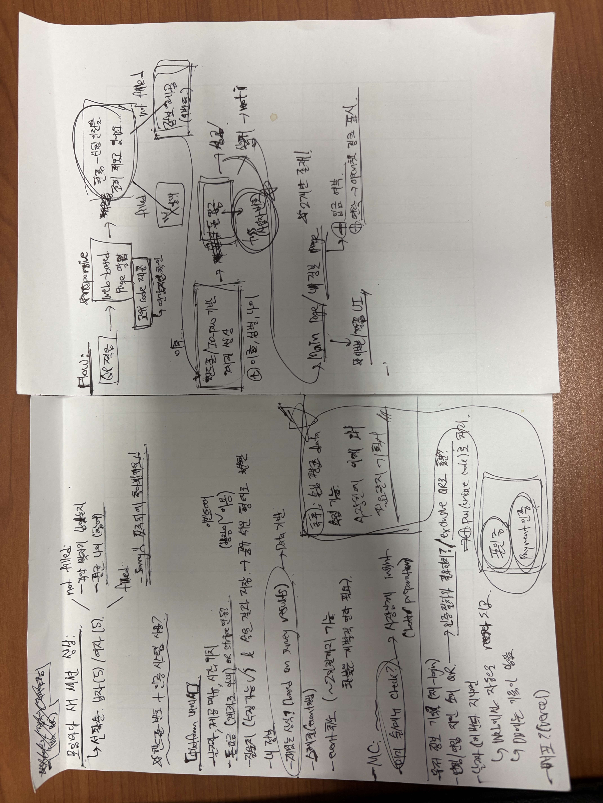

# 꺄르륵 파티 (Kyareureuk Party)

> _"오늘이 지나면 우리 사이, 달라질 거야"_

A private party organization and management platform built exclusively for [연림] (Yeonrim) bar.

## About

Kyareureuk Party is a private party that the Yeonrim bar hosts to their guests, helping people to find their own loves. It is an invitation-only platform designed for organizing exclusive events at [연림] bar. The platform ensures that only verified and trusted guests can participate in their event, maintaining the intimate and exclusive atmosphere that makes [연림] special.

## It All Started With...



The project began with hand-drawn sketches and brainstorming sessions, mapping out user flows, system architecture, and feature requirements - which were thought based from personal experience.

## Features

### Event Management

- Interactive questionnaire system for participant matching
- Real-time participant status tracking with gender-based quotas
- Administrative dashboard with comprehensive participant statistics
- Manual approval workflow with admin oversight

### Payment System

- **Bank Transfer Payment**: Secure manual bank transfer system with admin verification
- **Note**: Initially attempted TossPayments integration, but transitioned to manual bank transfer for better control and flexibility
- Payment status tracking and approval management
- Comprehensive refund policy with detailed terms

### Social Authentication

- Kakao OAuth integration for seamless login
- Streamlined user onboarding with profile management
- Social login capabilities with user state tracking

### Route Protection & Security

- Comprehensive URL protection preventing manual navigation
- Session-based state management with proper flow enforcement
- User intent tracking and validation throughout the application
- Secure admin access controls

### Responsive Design

- Mobile-first approach optimized for smartphone usage
- Modern UI with Tailwind CSS and consistent styling
- Radix UI components for accessibility and usability

## Tech Stack

### Frontend

- **Next.js 16** - React framework with App Router
- **React 19** - Latest React with concurrent features
- **TypeScript** - Type-safe development
- **Tailwind CSS 4** - Utility-first styling
- **Radix UI** - Accessible component primitives

### Backend & Database

- **Firebase** - Authentication and Firestore database with real-time updates
- **Next.js API Routes** - Serverless backend functions for authentication and data processing
- **Firestore Security** - Memory-based filtering to handle complex queries without composite indexes

### Payment & Authentication

- **Bank Transfer System** - Manual payment processing with admin verification
- **Kakao OAuth** - Social authentication with user state management
- **Session Management** - Secure session storage with route protection

### Deployment

- **Vercel** - Hosting and deployment platform

## Getting Started

### Prerequisites

- Node.js 18+
- npm or yarn
- Firebase project setup with Firestore database
- Kakao Developers account (for OAuth integration)
- Bank account for manual payment processing

### Installation

1. **Clone the repository**

   ```bash
   git clone https://github.com/dkim1112/Party-Organizer.git
   cd kyareureuk-party
   ```

2. **Install dependencies**

   ```bash
   npm install
   ```

3. **Environment Setup**
   Create a `.env.local` file with the following variables:

   ```env
   # Firebase Configuration
   NEXT_PUBLIC_FIREBASE_API_KEY=your_firebase_api_key
   NEXT_PUBLIC_FIREBASE_AUTH_DOMAIN=your_auth_domain
   NEXT_PUBLIC_FIREBASE_PROJECT_ID=your_project_id
   NEXT_PUBLIC_FIREBASE_STORAGE_BUCKET=your_storage_bucket
   NEXT_PUBLIC_FIREBASE_MESSAGING_SENDER_ID=your_sender_id
   NEXT_PUBLIC_FIREBASE_APP_ID=your_app_id

   # Kakao OAuth
   NEXT_PUBLIC_KAKAO_JS_KEY=your_kakao_javascript_key
   KAKAO_CLIENT_ID=your_kakao_client_id
   KAKAO_CLIENT_SECRET=your_kakao_client_secret

   # Bar Password (for access control)
   BAR_PASSWORD=your_secure_password
   ```

4. **Run the development server**

   ```bash
   npm run dev
   ```

5. **Open your browser**
   Navigate to [http://localhost:3000](http://localhost:3000)

## Project Structure

```
kyareureuk-party/
├── src/
│   ├── app/                    # Next.js App Router pages
│   │   ├── admin/             # Admin dashboard with approval management
│   │   ├── api/               # API routes
│   │   │   └── auth/          # Authentication endpoints (Kakao OAuth)
│   │   ├── auth/              # Authentication flow with user state handling
│   │   ├── bank-transfer/     # Bank transfer payment processing
│   │   ├── dashboard/         # User dashboard with event info
│   │   ├── questionnaire/     # Event questionnaire system
│   │   ├── status/            # Real-time participant status tracking
│   │   ├── waiting/           # Approval waiting page with polling
│   │   └── page.tsx           # Home page with password protection
│   ├── components/            # React components
│   │   ├── common/            # Shared components (LoadingSpinner, etc.)
│   │   ├── layout/            # Layout components (AppLayout)
│   │   └── ui/                # UI primitives (Radix-based components)
│   ├── lib/                   # Utility libraries
│   │   ├── firebase.ts        # Firebase configuration
│   │   ├── firestore.ts       # Database operations with approval workflow
│   │   └── utils.ts           # General utilities
│   └── types/                 # TypeScript type definitions
├── public/                    # Static assets
├── ideation.jpeg              # Initial project sketches
└── package.json               # Dependencies and scripts
```

## Development

### Available Scripts

- `npm run dev` - Start development server
- `npm run build` - Build for production
- `npm run start` - Start production server
- `npm run lint` - Run ESLint

## Contact

For questions or access requests: [dkim1112](https://github.com/dkim1112)

---

_Made for the [연림] community, by Dongeun Kim._
